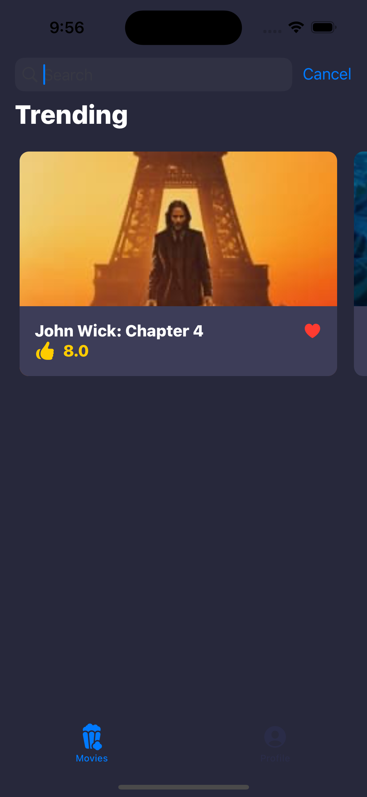
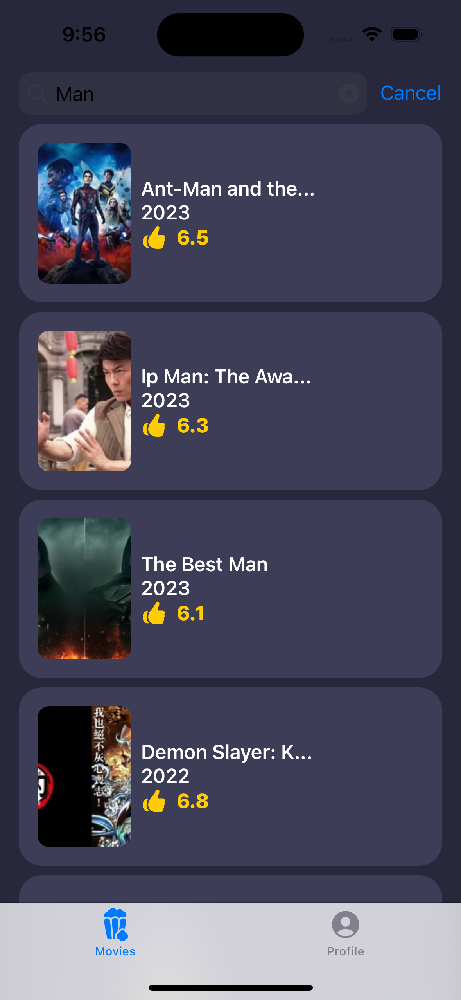

# Architecture
This application uses MVVM

# Offline Storage
Firebase firestore storage.

# Design Patterns
Async await.

# Testing
Units tests for success and failure situations.Mocked responses using MockNetworkManager, MockRepository, MockRestAPIManager

# Screenshots

Horizontal scroll of Trending Movies
 

Profile Page
 

List showing search results page

